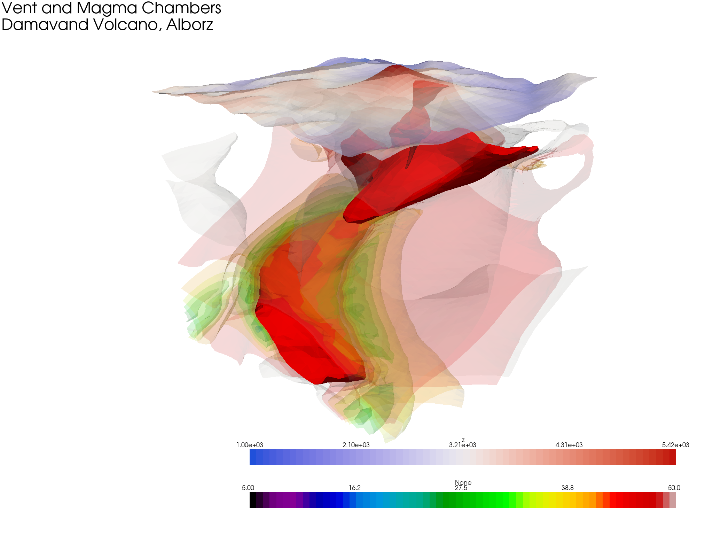

# PyVista Damavand Volcano

[PyVista](https://www.pyvista.org) is leveraged to quickly visualize 3D models of Damavand Volcano, Alborz, Iran.

This is an adaption of [Alexey Pechnikov](https://orcid.org/0000-0001-9626-8615) and [A.V.Durandin](https://orcid.org/0000-0001-6468-9757)'s [ParaView-MoshaFault](https://github.com/mobigroup/ParaView-MoshaFault)

See LinkedIn posts for more details:

- [The slices of the 3D model of the density on the Mosha fault area, North Iran](https://www.linkedin.com/posts/activity-6610080454911631360-97-V/)

- [Comparing Magnetic and Gravity Data to the Mosha Fault Area](https://www.linkedin.com/posts/activity-6609736436344201216-Kxls/)

- [North Iran, Mosha fault](https://www.linkedin.com/posts/activity-6609681862937853952-2BPG/)

- [North Iran](https://www.linkedin.com/posts/activity-6609486793676996608-ZF-J/)

## Installation

Simply install PyVista (see [installation](https://docs.pyvista.org/getting-started/installation.html) for tips):

```bash
pip install -U pyvista
```

# How it looks

